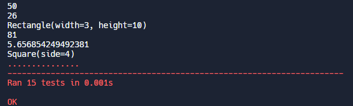

# Polygon Area Calculator

 

## Assignment

In this project you will use object oriented programming to create a Rectangle class and a Square class. The Square class should be a subclass of Rectangle and inherit methods and attributes.

#### Rectangle class
When a Rectangle object is created, it should be initialized with `width` and `height` attributes. The class should also contain the following methods:
* `set_width`
* `set_height`
* `get_area`: Returns area (`width * height`)
* `get_perimeter`: Returns perimeter (`2 * width + 2 * height`)
* `get_diagonal`: Returns diagonal (`(width ** 2 + height ** 2) ** .5`)
* `get_picture`: Returns a string that represents the shape using lines of "\*". The number of lines should be equal to the height and the number of "\*" in each line should be equal to the width. There should be a new line (`\n`) at the end of each line. If the width or height is larger than 50, this should return the string: "Too big for picture.".
* `get_amount_inside`: Takes another shape (square or rectangle) as an argument. Returns the number of times the passed in shape could fit inside the shape (with no rotations). For instance, a rectangle with a width of 4 and a height of 8 could fit in two squares with sides of 4.
